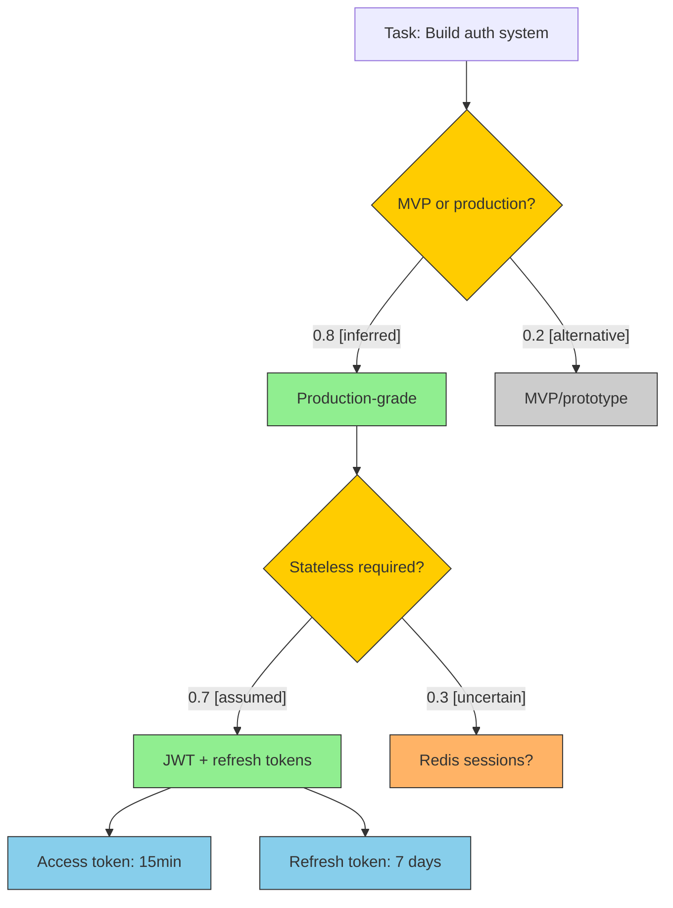

# Reasoning graph generation

> Reference for: common-ground
> Load when: using `--graph`, generating mermaid diagrams

Ported from `jeffallan/claude-skills@e8be415`
`commands/common-ground/references/reasoning-graph.md`. Mermaid conventions are
unchanged except for one defect fix (alternative-node prefix, below). Rendering is
native — kingdom artifacts render mermaid from fenced blocks, so no external
diagram tooling is involved.

---

## Purpose

The graph makes the *structure* of the reasoning visible, not just its premises:

- `COMMON-GROUND.md` = the premises (what is being assumed)
- the reasoning graph = the structure (how decisions connect)

---

## Node types

| Node type | Shape | Colour | Syntax | Meaning |
|-----------|-------|--------|--------|---------|
| Task / goal | Rectangle | default | `ROOT[Task: …]` | Root of the tree |
| Decision point | Diamond | yellow `#ffcc00` | `D1{Question?}` | Fork requiring a choice |
| Chosen path | Rectangle | green `#90EE90` | `P1[Path name]` | High confidence, taken |
| Alternative | Rectangle | grey `#cccccc` | `ALT1[Alternative]` | Considered, not taken |
| Uncertain | Rectangle | orange `#FFB366` | `U1[Uncertain?]` | Low confidence, needs clarification |
| Implementation | Rectangle | blue `#87CEEB` | `I1[Detail]` | Concrete decision or action |

> **Divergence from upstream — alternative nodes are `ALT{n}`, not `A{n}`.**
> Upstream used `A{n}` for graph alternatives *and* `A{n}` for assumption IDs
> (`A001`). After `--graph` both live in the same file, so `A1` and `A001` collide
> in one namespace and a reader cannot tell an alternative branch from an
> assumption. `ALT{n}` removes the ambiguity; nothing else about the graph changes.

---

## Edge labels

Carry a weight and a source tag where meaningful:

```
D1 -->|"weight: 0.8 [stated]"| P1
D1 -->|"[uncertain]"| U1
D1 -->|"[alternative]"| ALT1
```

| Tag | Meaning | Typical weight |
|-----|---------|----------------|
| `[stated]` | Owner explicitly said this | 0.8 – 1.0 |
| `[inferred]` | Derived from code/config | 0.6 – 0.8 |
| `[assumed]` | Best-practice default | 0.5 – 0.7 |
| `[uncertain]` | Needs clarification | 0.2 – 0.5 |
| `[alternative]` | Considered, not taken | 0.1 – 0.3 |

Labels stay under ~30 characters, in sentence case. Decision points end with `?`.

---

## Generation process

1. **Identify the root task** from conversation context.
2. **Map major decisions** — for each ESTABLISHED or WORKING assumption, trace
   back: what decision produced it, and what alternatives existed?
3. **Build the tree** — connect decisions hierarchically.
4. **Add leaf implementations** for concrete ESTABLISHED assumptions.
5. **Mark uncertainty** — every OPEN assumption should surface as a `U{n}` node.
6. **Apply styling** for every node, after all node definitions.

---

## Worked example



---

## Embedding

Write the mermaid to a file, then hand it to the script — it validates, archives
any previous graph, embeds the block under `## Reasoning Graph`, and appends the
legend:

```bash
automate-dev-suite/scripts/common-ground.sh graph --file /path/to/graph.mermaid
```

Add `--standalone` to also write `REASONING.mermaid` **into the kingdom state
directory**. It never goes in the project working tree — that would push it to the
project's own remote and breach the DD-001 boundary.

The script requires the content to begin with `flowchart` and rejects anything
else, so a malformed graph cannot land in the ground file.

---

## Validation rules

**Must have:** exactly one `ROOT`; at least one decision point; styling for every
node; labelled decision edges.

**Must not have:** orphan nodes; cycles (this is a tree); missing style
definitions; unlabelled decision edges.

---

## Conversational updates

| Owner says | Action |
|-----------|--------|
| "Expand the {branch} branch" | Add downstream decisions for that path, regenerate |
| "Why not {alternative}?" | Explain the reasoning, adjust weights if warranted |
| "I actually want {alternative}" | Swap styling — the alternative becomes the chosen path — update weights, regenerate |
| "What's downstream of {node}?" | Add child nodes, regenerate |

Regenerate after each significant change. **Always preserve the full tree —
never delete alternatives, just leave them greyed out.** Superseded graphs are
archived automatically on re-embed, so history is never lost.
